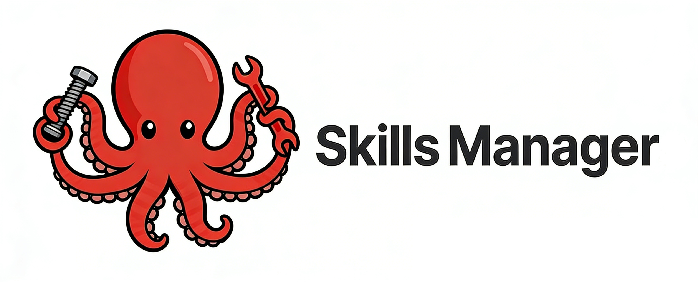
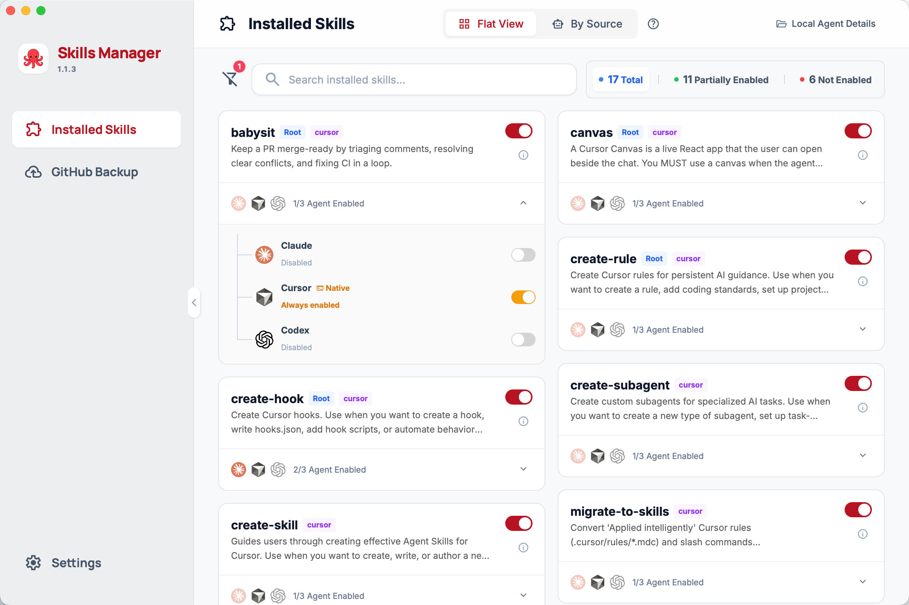
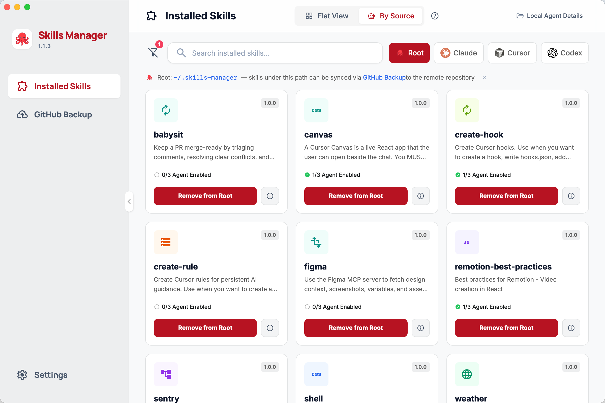
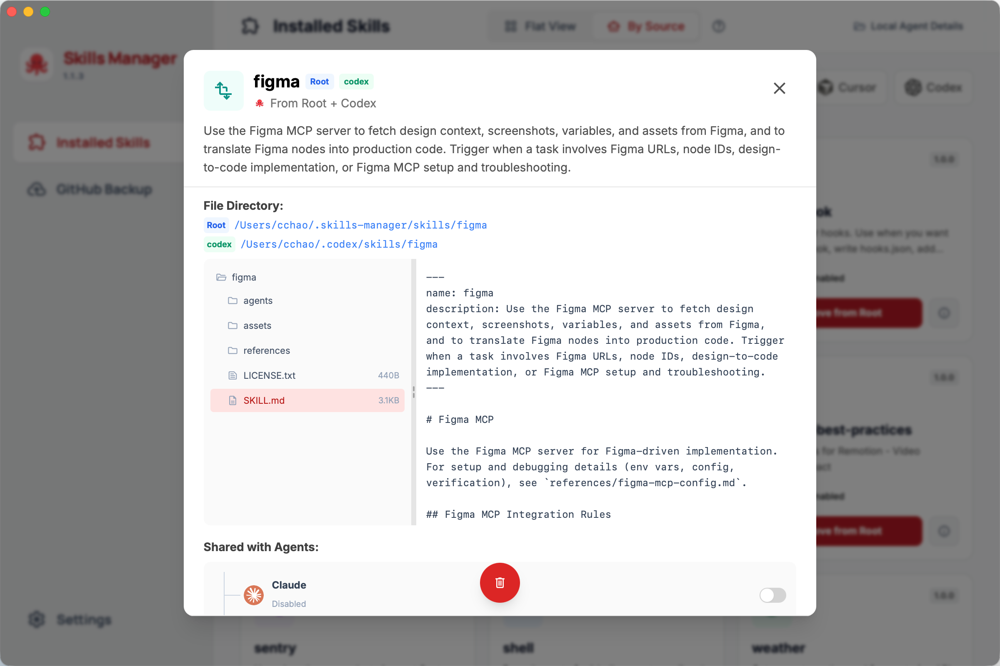
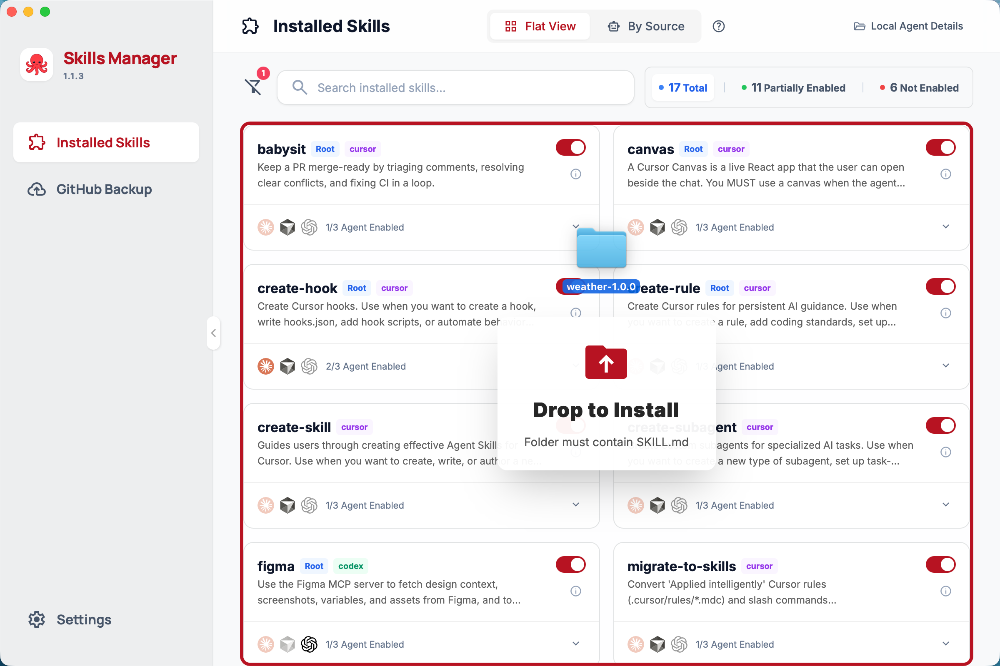
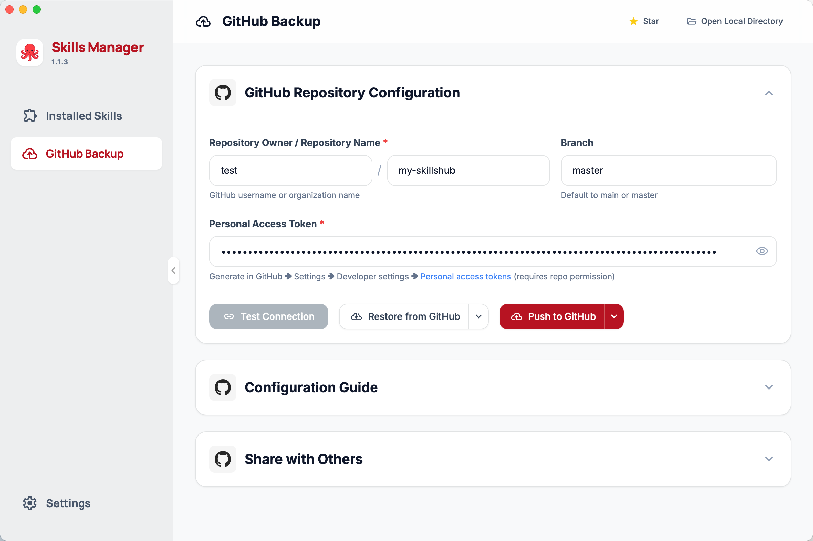
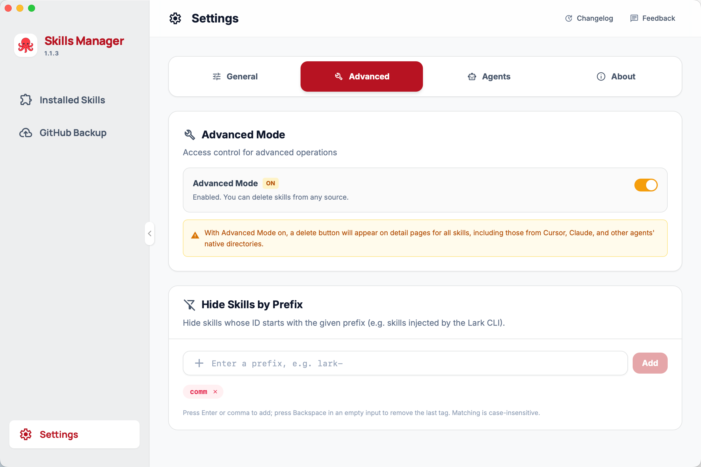

<div align="center">



### <strong>One-Click Sharing + One-Click Sync</strong>. Use skills more elegantly across multiple Agents, and build your personal skill repository more gracefully through <strong>Skills Manager</strong>.

[](https://tauri.app/)
[](https://reactjs.org/)
[](https://www.typescriptlang.org/)
[](LICENSE)
[](README.en.md)

<p>
  <strong>Readme language / 文档语言</strong><br />
  <a href="README.md">中文</a> · <b>English</b>
</p>

<p><a href="https://github.com/cchao123/skills-managers/issues">Feedback (GitHub Issues)</a></p>

</div>

---

## Features

### Installed Skills List

- **One-Click Sharing**: Link to target Agents via master toggle/sub-toggles;
- **Multiple Views**: Aggregate and efficiently manage existing skills, quickly view skill details;
- **Drag & Drop Import**: Support dragging folders into the app (requires SKILL.md)






### GitHub Backup / Build Claude Code Marketplace

- **Sync to GitHub**: Push central storage skills to remote
- **Restore from GitHub**: Pull skills from repo to local on new machine
- **Build Marketplace**: Backed up repo can serve as Claude Code Marketplace for others



### Settings
- **Memory Filtering**: Filter skills injected by cli/workflow in views for cleaner lists
- **Delete Protection**: As a plugin, no permission to edit Agent files by default, manual enable required



---

## Tech stack

| Layer | Stack |
|-------|--------|
| Frontend | React 18, TypeScript, Vite 5, Tailwind CSS, react-i18next |
| Desktop | Tauri 2 (Rust) |
| Typical deps | serde, git2, ureq, walkdir, etc. |

Development and builds require **Node.js** and **Rust**; on macOS, **OpenSSL** may be needed for some native deps (see below).

---

## Quick start

### Prerequisites

- **Node.js 18+** (`npm` or `pnpm`, match the repo lockfile)
- **Rust** (stable via `rustup`)
- **macOS**: if you hit OpenSSL errors, with Homebrew:
  ```bash
  brew install openssl@3
  export OPENSSL_DIR=$(brew --prefix openssl@3)
  export PKG_CONFIG_PATH=$(brew --prefix openssl@3)/lib/pkgconfig
  ```

### Clone and install

```bash
git clone <repository-url>
cd skills-managers
npm install
```

### Optional: enable analytics & monitoring (Aptabase + Sentry)

```bash
cp .env.example .env
```

Fill in what you need:

- `APTABASE_APP_KEY`: product events (frontend `trackEvent` + Rust lifecycle events)
- `VITE_SENTRY_DSN`: frontend React error reporting
- `SENTRY_DSN`: Rust panic / error reporting
- `VITE_ENABLE_TELEMETRY=false`: hard-disable frontend telemetry

### Development

```bash
npm run tauri:dev
```

Starts Vite (default `http://localhost:5173`) and opens the desktop window; frontend hot reload, Rust changes follow the usual Tauri rebuild flow.

In a **plain browser**, some features use mock data; use the Tauri window for full behavior.

---

## Build & release

```bash
# Windows x64
npm run tauri:build

# macOS (targets as needed; see Tauri docs)
npm run tauri:build -- --target aarch64-apple-darwin
npm run tauri:build -- --target x86_64-apple-darwin
```

Artifacts live under `src-tauri/target/release/` and `src-tauri/target/release/bundle/` (installers depend on platform).

For Rust-only iteration:

```bash
cargo build --manifest-path=src-tauri/Cargo.toml
```

---

## Config & data paths (summary)

- App config: `~/.skills-manager/config.json` (skill enablement, agents, language, etc.)
- Central skills dir: `~/.skills-manager/skills/`
- GitHub backup fields are stored in that config system (exact fields depend on version)

Skill metadata comes from **`SKILL.md`** in each folder (YAML frontmatter recommended: `name`, `description`, etc.).

---

## Troubleshooting

| Symptom | What to try |
|---------|----------------|
| Icon format errors | `npx @tauri-apps/cli icon <source-image>` |
| Port 5173 in use | Free the port or change Vite port |
| macOS OpenSSL | Set `OPENSSL_DIR` / `PKG_CONFIG_PATH` as above |
| Empty skill list | Install agents, ensure paths and `SKILL.md` exist, rescan in the UI |

More developer notes: **`CLAUDE.md`** at repo root; design history under **`docs/`** (some are snapshots—trust the code).

---

## Repository layout (short)

```
skills-manager/
├── app/                 # React frontend (Vite)
├── src-tauri/           # Tauri + Rust backend
├── docs/                # Docs & assets (e.g. docs/assets/logo.png)
├── LICENSE
├── README.md            # Chinese readme
└── README.en.md         # This file (English)
```

---

## Contributing

[GitHub Issues](https://github.com/cchao123/skills-managers/issues) and pull requests welcome: features, docs, i18n, bug fixes.

1. Fork the repo  
2. Branch: `git checkout -b feature/your-feature`  
3. Commit and push  
4. Open a pull request  

Before pushing, run **`npm run build`** (includes `tsc`) and **`cargo build`** when you can to reduce CI noise.

---

## License

**MIT** — see [`LICENSE`](LICENSE).

---

## Acknowledgments

- [Tauri](https://tauri.app/) · [Material Symbols](https://fonts.google.com/icons) · [Claude Code](https://claude.ai/code)
