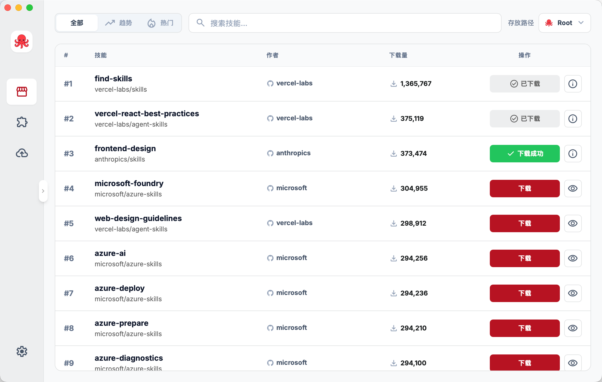
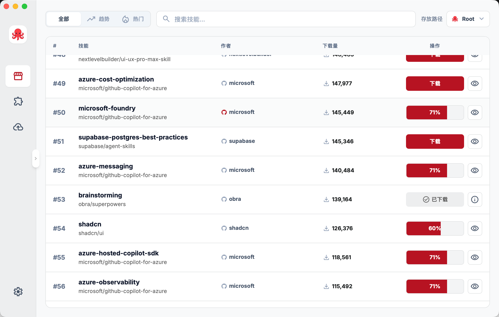

<div align="center">


### A desktop app for managing, syncing, and distributing skills across AI agents.

[](https://tauri.app/)
[](https://reactjs.org/)
[](https://www.typescriptlang.org/)
[](LICENSE)
[](README.en.md)

<p>
  <strong>Readme language / 文档语言</strong><br />
  <a href="README.md">中文</a> · <b>English</b>
</p>

<p><a href="https://github.com/cchao123/skills-managers/issues">Feedback (GitHub Issues)</a></p>

</div>

---

## What It Is

**Skills Manager** is a desktop app built with **Tauri 2 + React + Rust** for managing skills for Claude Code and other AI agents with a unified platform.

It is designed around a few core workflows:

- **Marketplace**: browse, search, and install community skills with one click, featuring All Time, Trending, and Hot rankings
- **Unified scanning**: collect skills from multiple agent directories into one manageable view
- **Cross-agent distribution**: link or copy the same skill into different agents
- **Central storage**: keep reusable skills in one place for easier maintenance and migration
- **GitHub backup and restore**: push your skills repository to GitHub or restore it on a new machine
- **CI/CD automation**: automated cross-platform builds and releases via GitHub Actions

Supported agents currently include **Claude, Cursor, Codex, OpenClaw, and OpenCode**.

---

## Features

### Marketplace

- **Three rankings**: All Time, Trending, and Hot leaderboards
- **Smart search**: quickly filter by skill name or description
- **One-click install**: select target agent and download/enable skills instantly
- **Details preview**: view skill's SKILL.md content, statistics, security audits, and more
- **Progress tracking**: real-time download progress and installation status
- **Agent selector**: choose to install to Root or specific agent directories




### Skill Overview and Management

- **Unified view**: manage skills from different sources in one interface
- **Per-agent toggles**: control whether a skill is enabled for each agent
- **Source and file inspection**: view skill details, sources, and file trees
- **Drag-and-drop import**: import any folder that contains a `SKILL.md`


### GitHub Backup and Distribution

- **Sync to GitHub**: push your local skills repository to a remote repo
- **Restore from GitHub**: pull the repository back onto a new machine
- **Share a curated repository**: use a GitHub repo as a portable skills distribution source


---

## Tech stack

| Layer | Stack |
|-------|--------|
| Frontend | React 18, TypeScript, Vite 5, Tailwind CSS, react-i18next |
| Desktop | Tauri 2 (Rust) |
| CI/CD | GitHub Actions (multi-platform builds, automated releases) |
| Typical deps | serde, git2, ureq, walkdir, etc. |

Development and builds require **Node.js** and **Rust**; on macOS, **OpenSSL** may be needed for some native deps (see below).

---

## Quick start

### Prerequisites

- **Node.js 18+** (`npm` or `pnpm`, match the repo lockfile)
- **Rust** (stable via `rustup`)
- **macOS**: if you hit OpenSSL errors, with Homebrew:
  ```bash
  brew install openssl@3
  export OPENSSL_DIR=$(brew --prefix openssl@3)
  export PKG_CONFIG_PATH=$(brew --prefix openssl@3)/lib/pkgconfig
  ```

### Clone and install

```bash
git clone <repository-url>
cd skills-managers
npm install
```

### Optional: enable analytics & monitoring (Aptabase + Sentry)

The app reads environment variables from files such as `.env`, `.env.local`, and `src-tauri/.env`. If you want analytics or monitoring, create a `.env` file and fill in what you need:

- `APTABASE_APP_KEY`: product events (frontend `trackEvent` + Rust lifecycle events)
- `VITE_SENTRY_DSN`: frontend React error reporting
- `SENTRY_DSN`: Rust panic / error reporting
- `VITE_ENABLE_TELEMETRY=false`: hard-disable frontend telemetry

### Development

```bash
npm run tauri:dev
```

Starts Vite (default `http://localhost:5173`) and opens the desktop window; frontend changes hot reload, while Rust changes follow the normal Tauri rebuild flow.

In a **plain browser**, some features use mock data; use the Tauri window for full behavior.

---

## Build & release

```bash
# Windows x64
npm run tauri:build

# macOS (targets as needed; see Tauri docs)
npm run tauri:build -- --target aarch64-apple-darwin
npm run tauri:build -- --target x86_64-apple-darwin
```

Artifacts live under `src-tauri/target/release/` and `src-tauri/target/release/bundle/` (installers depend on platform).

For Rust-only iteration:

```bash
cargo build --manifest-path=src-tauri/Cargo.toml
```

---

## Config & data paths (summary)

- App config: `~/.skills-manager/config.json` (skill enablement, agents, language, etc.)
- Central skills dir: `~/.skills-manager/skills/`
- GitHub config: `~/.skills-manager/github-config.json`

Skill metadata comes from **`SKILL.md`** in each folder (YAML frontmatter recommended: `name`, `description`, etc.).

---

## CI/CD Automated Builds

The project uses **GitHub Actions** for automated building and releasing:

### Build Workflow (`.github/workflows/build.yml`)

**Triggers:**
- Tag push: `v*` (e.g., `v1.0.4`)
- Manual workflow dispatch with optional tag specification

**Supported platforms:**
- macOS ARM64 (Apple Silicon)
- macOS x64 (Intel)
- Windows x64

**Build artifacts:**
- macOS: `.app`, `.app.tar.gz`, `.dmg`
- Windows: `.exe` (NSIS installer), `.msi` (Windows Installer)

**Automated releases:**
- Automatically creates GitHub Release after successful build
- Uploads artifacts as Release Assets
- Supports environment variables for monitoring and analytics (Aptabase, Sentry)

### Usage

```bash
# Create and push a tag to trigger automated build
git tag v1.0.4
git push origin v1.0.4

# Or manually trigger the workflow from GitHub Actions page
```

---

## Troubleshooting

| Symptom | What to try |
|---------|----------------|
| Icon format errors | `npx @tauri-apps/cli icon <source-image>` |
| Port 5173 in use | Free the port or change Vite port |
| macOS OpenSSL | Set `OPENSSL_DIR` / `PKG_CONFIG_PATH` as above |
| Empty skill list | Install agents, ensure paths and `SKILL.md` exist, rescan in the UI |
| Marketplace won't load | Check network connection, ensure access to skills.sh API |
| GitHub backup fails | Verify GitHub Token has repo read/write permissions, check repo config |
| Skill install fails | Ensure target agent directory exists with write permissions, check disk space |

For more screenshots and static documentation, see **`docs/`**. If docs and code ever disagree, trust the current code.

---

## Repository layout (short)

```
skills-manager/
├── .github/workflows/   # GitHub Actions CI/CD configurations
│   ├── build.yml        # Multi-platform build workflow
│   └── deploy-pages.yml # Pages deployment workflow
├── app/                 # React frontend (Vite)
│   └── src/
│       ├── pages/       # Page components
│       │   ├── Dashboard/       # Skill management homepage
│       │   ├── SkillDownload.tsx # Marketplace skills market
│       │   ├── GitHubBackup/    # GitHub backup page
│       │   └── Settings/        # Settings page
│       └── api/         # Tauri API wrappers
├── src-tauri/           # Tauri + Rust backend
│   ├── src/
│   │   ├── commands/   # Tauri command handlers
│   │   └── *.rs        # Core business logic
├── docs/                # Docs & assets (e.g. docs/assets/logo.png)
├── LICENSE
├── README.md            # Chinese readme
└── README.en.md         # This file (English)
```

---

## Contributing

[GitHub Issues](https://github.com/cchao123/skills-managers/issues) and pull requests welcome: features, docs, i18n, bug fixes.

1. Fork the repo  
2. Branch: `git checkout -b feature/your-feature`  
3. Commit and push  
4. Open a pull request  

Before pushing, run **`npm run build`** (includes `tsc`) and **`cargo build`** when you can to reduce CI noise.

---

## License

**MIT** — see [`LICENSE`](LICENSE).

---

## Acknowledgments

- [Tauri](https://tauri.app/) · [Material Symbols](https://fonts.google.com/icons) · [Claude Code](https://claude.ai/code)
